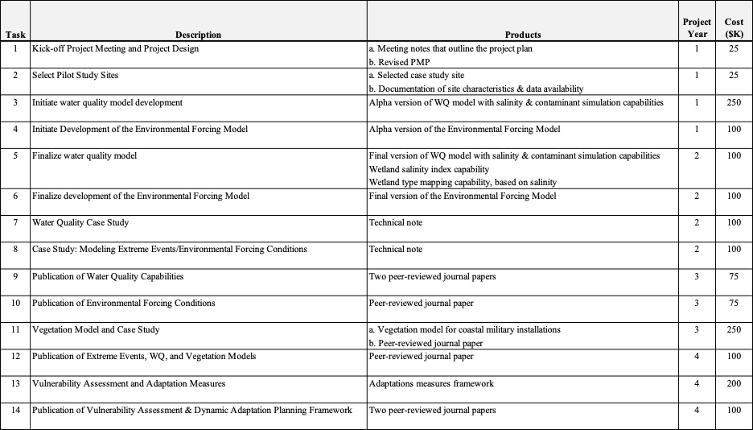

#### Revision date June 14, 2020, based on version sent on June 8, 2020 to Brandon Lafferty for review.

 # II. PMP Outline

## 1. Project Title: Integrated Risk-Based Environmental Modeling of Extreme Coastal Weather Events

## 2. P2 Project #: XXXX

## 3. PMP Approver:  Dr. Elizabeth Ferguson

## 4. Complete List of PDT Members:  This list should include the customer/sponsor, project manager, responsible branch chief(s), and all appropriate team members.
| Organization | Role | Name | Phone | E-Mail |
|:--|:--|:--|:--|:--|
| USACE | Customer/Sponsor ||||
| CEERD-EP-W | Project Manager/PI ||||
| CEERD-EP-W | Branch Chief/PM Proxy ||||
| | Team Member(s) ||||
| CEERD-EP-W | PI | Dr. Todd E. Steissberg | 530-219-7990 | Todd.E.Steissberg@usace.army.mil |
| CEERD-EP-W | Co-PI | Mr. John R. Kucharski | 916-879-3155 | John.R.Kucharski@usace.army.mil |
| CEERD-EP-W | Co-PI | Dr. Billy E. Johnson | 601-415-6299 | Billy.E.Johnson@usace.army.mil |
| CEERD-EP-W | Co-PI | Dr. Jodi L. Ryder | 601-634-4205 | Jodi.L.Ryder@usace.army.mil |
| CEERD-EP-W | Data Scientist | Mr. Kervi Ramos | 530-601-7335 | Kervi.Ramos@usace.army.mil |
| CEERD-EE-W | Ecologist | Dr. Todd Swannack | 601-415-3509 | Todd.M.Swannack@usace.army.mil |
| CEERD-EE-E | Ecologist | Dr. Chuck Theiling | 601-634-3684 | Charles.H.Theiling@usace.army.mil |
| CEERD-EM-J | PM Proxy | Jessica Coleman | 601-634-3976 | Jessica.G.Coleman@us.army.mil |

## 5. References:

This PMP is being developed in coordination with the ACTIONS team.

## 6. Background/Problem Description:

Military installations in coastal areas are threatened when a web of natural processes surrounding extreme weather events combine to drive hazards such as inundation, erosion, increased salinity, and other soil issues which limit land use for military activities. Impacts can be caused by a single meteorological event (e.g. extreme precipitation) or by a combination of separate events that occur either simultaneously or in close succession. For example, intense long-duration rainfall may occur before a strong wind event that combines with low atmospheric pressure to create a storm surge, resulting in overwash from the ocean, amplified by runoff from overflowing streams. Past studies have largely focused on historical events or statistical models of water levels to estimate risks to natural systems. However, research has shown that these methods are error prone and incapable of accurately evaluating risk due to the short period of record available in most location and the complexity of interactions between waves, surge and weather which combine to produce hazardous events ([Santiago-Collazo, 2019](#santiago-collazo-2019)). Extreme events are linked to water quality concerns that are linked to soil and vegetation dynamics. However, the integrated assessment of extreme events, water quality, soil, and vegetation has been a significant gap in coastal modeling. To understand the range of natural threats to the use of land, freedom of movement, continuity of operations, on coastal military installations, research is required that links the range of potential wave, surge and weather events to hydrodynamic processes, coastal morphology, water quality, soil systems and vegetation, which drive available land uses and freedom of movement in coastal systems. 

## 7. Technical Objective/Project Scope:

This task will develop integrated models that simulate water levels and flow, water quality (salinity, nutrients, temperature, and contaminants), vegetation dynamics (in collaboration with our ACTIONS partners), land use change, and dynamic adaptation pathways. Risk based time series of extreme coastal events will drive water quality and land use impact models, from which a full understanding of vulnerabilities and dynamic adaptation pathways will be developed. These integrated models will enable military installation planners and managers to assess and respond to risks to natural infrastructure in their coastal systems. 
      
Past research has shown that the dimensionality of hazards that combine to produce extreme events in coastal events can lead to myopic assessments of vulnerability and the occurrence of "surprise" events and catastrophic scenarios ([Anderson et al., 2019](#anderson-et-al-2019)). Traditional event-based hydrologic and hydraulic modeling is a time-intensive process that cannot adequately represent the large set of possible combinations of scenarios. For example, the timing, duration, magnitude, and spatial extent of storm surge combined with extreme precipitation and riverine flooding can lead to a wide variety of type and magnitude of impacts ([Santiago-Collazo, 2019](#santiago-collazo-2019)) to terrain, structures, military operations, and natural infrastructure on military installations. Stochastic simulation and scenario exploration programs provide the capability to investigate this large array of factors to give a more complete understanding of risks in coastal areas and enable developing more robust risk mitigation strategies, such as implementing erosion control and water quality protection strategies, fortifying and protecting critical infrastructure, developing robust operating plans that consider timing and flow of flood waters, as well as plans for post-event recovery due to erosion and salinity impacts and contaminant spills or releases from soils. In this task, a full range of internally consistent extreme water level and flow events will be stochastically simulated. These water levels and flow will be used as boundary conditions for downstream water quality, vegetation and land use change models.

The flow of water, nutrients, salinity, and contaminants through the watershed have a profound effect on vegetation growth, mortality, distribution, and species composition as well as the chemical and structural properties of soil and the morphology of the landscape due to erosion and sediment deposition. These, in turn, affect the terrain of military installations, which affects mobility and operations. We have developed several water quality modules that can be linked with or integrated into existing hydrologic and hydraulic models to simulate temperature, nutrients, contaminants, and other constituents in freshwater systems. We have integrated these with a number of models including HEC-RAS (River Analysis System) and the Gridded Surface Sub-surface Hydrologic Assessment (GSSHA) model. Under a separate project, ERDC is linking these modules with GSSHA model and coupling these capabilities with ERDC's multi-species vegetation models that simulate aquatic and terrestrial vegetation. We will extend these capabilities to include salinity effects on mixing processes and nutrient and contaminant chemistry. Then we will extend the contaminant simulation module to simulate the leaching of contaminants into surface runoff from soil under saline conditions. Finally, we will link the contaminant simulation capabilities with the GSSHA model.

Vegetation patterns and local and near-surface hydrology are highly interdependent. Plants tolerate specific ranges of surface and subsurface water availability that in turn influence the local hydrologic balance as they move water from their roots to leaves in the process of evapotranspiration. Plants in coastal environments also tolerate specific ranges of surface and subsurface water quality, especially salinity levels. The impacts of extreme coastal events on aquatic and terrestrial vegetation (destruction, movement, growth, and change in species composition, etc.) can affect the use of land and maneuverability on military installations. These changes in vegetation can also increase the vulnerability of installations to future extreme events. The project will improve the DOD's ability to assess the exposure of military installations to threats driven by extreme events in coastal regions, such as storm surges and extreme precipitation. These events can cause severe erosion, long-term pooling of water, changes in the concentrations and distribution of nutrients, salinity, and contaminants, which have an impact on soil chemistry and vegetation. 

The integrated hydrologic, water quality, and vegetation models will enable users to solve several fundamental issues that lead to poorly understood risk, "surprise" hazards and an inability to adapt to ever-evolving threats. More specifically, it will include a coastal process model which will produce a full range of internally consistent boundary conditions that drive coastal hazards due to storm surges combined with extreme precipitation-runoff events. The number of processes contributing to these events is too high for relatively short historical records to have measured all of the relevant combinations of surge (driven by strong wind and low atmospheric pressure), waves, sea level anomalies, river overflow, and watershed runoff. Therefore, stochastic models will be developed to simulate the environmental forcing processes (time series) that occur under extreme coastal conditions. These environmental forcing time series will be used to drive numerical models that simulate watershed runoff and water quality (nutrients, salinity, temperature, etc.). The outputs of these models will be linked with ERDC's multi-species aquatic and terrestrial vegetation model (in collaboration with our ACTIONS partners) to simulate changes in vegetation health, distribution, and species composition. The hydrologic and hydraulic model outputs will be used to estimate flood damage to the military installations. These outcomes will then be used to develop integrated vulnerability assessments. Dynamic adaptation plans and pathways addressing the specific vulnerabilities of the system will, in turn, be identified ([Poff et al., 2015](#poff-et-al-2015); [Haasnoot et al., 2013](#haasnoot-et-al-2013); [Brown et al., 2015](#brown-et-al-2015); [Herman et al. 2020)](#herman-et-al-2020).

### Environmental Forcing Model

Coastal hazards are generally driven by the combined occurrence of multiple correlated time-dependent processes, including waves, surge, tides and freshwater flows driven by overland weather. To generate a plausible range of coastal hazards while preserving the complex interaction between the contributing processes, a model will be developed ([Steinschneider et al., 2019](#steinschneider-et-al-2019); [Steinschneider and Brown, 2013](#steinschneider-and-brown-2013); [Anderson et al., 2019](#anderson-et-al-2013); [Wilks and Wilby, 1999](#wilks-and-wilby-1999); [Wilks, 1998](#wilks-1998); [Wilks, 1992)](#wilks-1992)) to simulate a full range environmental forcing conditions. This fundamental research will significantly advance the understanding of coastal risks by linking multiple coastal and weather processes together in an internally and risk-based time series of extreme events. This computationally efficient model will be used within the context of a bottom-up framework that facilitates the exploration of a full range of system performance scenarios, while allowing for careful experimentation of cause-and-effect relationships. This leads to the identification of system vulnerabilities as a response to one or more environmental stressors. This framework has been applied in many coastal and non-coastal contexts with success. The coupling of wave and weather data within a unified stochastic model has been a long-standing goal of both academic and government-lead coastal investigation. However, it has only recently become possible with multiple stochastic wave and weather models being linked to similar atmospheric process on variable time scales ([Steinschneider et al., 2019](#steinschneider-et-al-2019); [Steinschneider and Brown, 2013](#steinschneider-and-brown-2013)). This provides an opportunity to better inform decision-making on military installations through the use of continuous traces of synthetic data containing the water level extremes of concern to DOD planners and managers in coastal systems. To evaluate the combined effects of combinations of waves, surge, wind, and sea level anomalies, a coastal wave/surge model ([Anderson et al., 2019](#anderson-et-al-2019)) will be incorporated into this model to create hypothetical combinations of processes that increase flood hazard potential. Predicting extreme coastal flooding is important for evaluating near-term and long-term system vulnerabilities, which will increase in importance as the mean sea level rises. The environmental forcing model will enable prediction of the types and magnitude of extreme coastal events. The outputs from this model will be analyzed and used to derive multiple alternative scenario inputs for the hydraulic, hydrologic, water quality, and vegetation models. These models will then be able to adequately predict the impacts of future extreme events on terrain and natural infrastructure, soil and water salinity levels, and short- and long-term release of toxic contaminants from military installation soils. The environmental forcing model will be used to derive input time series for multiple alternative future scenarios for this model, which will then drive the water quality and vegetation simulations. This model, combined with the hydrologic models developed by our ACTIONS partners and our water quality modesl, will enable military installations to develop more robust risk mitigation strategies, such as implementing erosion control and water quality protection strategies, fortifying and protecting critical infrastructure, developing robust operating plans that consider timing and flow of flood waters, as well as plans for post-event recovery due to erosion and salinity impacts and contaminant spills or releases from soils.

### Water Quality Model

The water quality simulation capabilities for this task will be provided by a set of existing ERDC-EL water quality modules linked with the GSSHA model developed by our ACTIONS partners. The capabilities of the Temperature, Nutrient, and Contaminant Simulation Modules (TSM, NSM, and CSM) will be extended in this task and integrated with the hydrology and vegetation models (described below). These modules simulate the water temperature and biogeochemistry of natural and contaminated freshwater systems, including rivers, streams, watershed runoff, lakes, reservoirs, and detention ponds ([Zhang and Johnson, 2016a](#zhang-and-johnson-2016a); [Zhang and Johnson, 2016b](#zhang-and-johnson-2016b)). The Temperature Simulation Module (TSM) computes water surface temperature by simulating radiative, sensible, and latent heat exchange with the environment and mixing processes resulting from meteorological forcing and density gradients. The Nutrient Simulation Modules (NSM-I and NSM-II) simulate carbonaceous biological oxygen demand (CBOD), dissolved oxygen (DO), simplified nitrogen and phosphorus cycles, which produce organic nitrogen, ammonia, nitrate-nitrite, organic phosphorus, total inorganic phosphorus, algae, and benthic algae biomass as additional state variables. NSM-I provides simplified aquatic chemistry, while NSM-II allows more complex simulation of chemical transformations and pathways. Both modules contain a sediment diagenesis sub-module to simulate sediment chemical transformations and exchange with the water column.

Salinity intrusion into freshwater systems alters their hydrodynamic properties, such as mixing processes. These processes affect the advection and diffusion of heat in these water bodies. Elevated salinity concentrations also affect nutrient and contaminant chemistry, e.g., by altering saturation concentration values, to the point that salinity can no longer be simulated independently of the other constituents (as a conservative constituent), as is common in purely freshwater environments. Therefore, the Temperature and Nutrient Simulation Modules (TSM and NSM) will be extended to consider the effects of salinity in coastal freshwater/brackish systems. The salinity modeling capabilities NSM will be extended to incorporate salinity into the chemical interactions. The data collected by our ACTIONS partners on effects of salinity on the leaching of nutrients from soils and sediments will be incorporated into this module, which will allow prediction of the effects of increased soil salinity on coastal freshwater systems.

The Contaminant Simulation Module (CSM) computes internal sources and sinks for a wide range of contaminants for both the water column and underlying sediment layer ([Zhang and Johnson, 2016a](#zhang-and-johnson-2016c)). CSM was designed for simulating general contaminants such as pesticides, polychlorinated biphenyls, halogenated aliphatic hydrocarbons, halogenated ethers, monocyclic aromatics, phthalate esters, polycyclic aromatic hydrocarbons, and nitrosamines. These chemicals can cause toxicity to aquatic organisms, or bioconcentrate through the food chain, affecting human health. CSM was designed for simulating general contaminants such as pesticides, polychlorinated biphenyls, halogenated aliphatic hydrocarbons, halogenated ethers, monocyclic aromatics, phthalate esters, polycyclic aromatic hydrocarbons, and nitrosamines. These chemicals can cause toxicity to aquatic organisms, or bioconcentrate through the food chain, affecting human health. Changes in inundation patterns and increased salinity exposure can alter soil geochemistry, leading to mobilization of previously sequestered contaminants ([LeMonte et al., 2017](#lemonth-et-al-2017), [Zhao et al., 2013](#zhao-et-al-2013)). Extreme coastal events can also increase the risk of contaminant releases (spills, etc.) from military facilities. Moreover, increased exposure to salinity can amplify contaminant impacts ([Schafer, et al., 2012](#schafer-et-al-2012)), further degrading ecosystem services and natural infrastructure. 

This task will extend the current water quality simulation capabilities to model temperature, nutrients, and contaminants for coastal military installations under a combination of freshwater and saline conditions. CSM will be extended to incorporate salinity and linked with the GSSHA model and the other water quality modules as well as the vegetation models. Soil data and determinations from the measurements and investigations of our ACTIONS partners will be used as inputs to the water quality model.  Required measurements include soil geochemistry (mineralogy, redox, pH, nutrients, etc.) and soil hydraulic properties (saturation, infiltration rate, etc.), as well as soil and water contaminants of concern at the selected study sites.

Data on soil chemistry and physical properties collected by our ACTIONS partners will inform the water quality modeling. For example, saturated hydraulic conductivity (Ksat) has significant effects on salt, pesticide, nutrient and contaminant leaching, pollution transport to groundwater, water infiltration and consequently, controlling surface runoff. This will enable more completely understanding and predicting the uses of complex terrain. 

Salinity concentrations in surface waters have a strong impact on the type of wetlands that can be supported at a particular elevation and distance from the coastal margin. A salinity index function will be added to the water quality tool in collaboration with our ACTIONS partners, which will predict the type of wetland supported at a particular location. A visualization tool will be created that will generate maps of salinity and wetland categories for multiple future scenarios.

### Vegetation Models

The vegetation models for this task will extend and adapt the existing ERDC terrestrial and aquatic vegetation models. Vegetation model development will consist of three steps: (1) Identify key indicator species of water balance dynamics at the selected field sites and examine the relationships between plant presence and local-scale environmental variables observed by the University of Delaware and ERDC collaborators. (2) Develop parameterized models to relate indicator species responses, such as growth and health, to the following: water balance components, soil conditions, surface and ground water quality, and change events. 3) Incorporate local-scale models and vegetation patterns into the landscape/watershed scale models to better depict vegetation-water balance relationships in modeling tools used by our ACTIONS partners. Soil data and determinations from the measurements and investigations of our ACTIONS partners, as well as results from our water quality simulations, will be used as inputs to the vegetation models.

### Vulnerability Assessment and Adaptation Planning

Using the outputs from the hydrologic, water quality, and vegetation simulations, vulnerabilities will be identified through a systematic and exhaustive scenario analysis -- driven by the weather and wave generator. Multi-objective dynamic adaptation pathways will be formulated which will allow mitigating against specific risks identified in the vulnerability analysis. The vulnerability assessment will assess tipping points in ecological function, water quality, flooding, and water supply indicators associated with natural variability in wind, wave and storm conditions, sea-level rise, and human factors -- such as water demands and population growth. Methods which will be employed will build on the foundation of well-established systems analysis, vulnerability assessment, and dynamic adaptation pathways ([Poff et al., 2015](#poff-et-al-2015); [Haasnoot et al., 2013](#haasnoot-et-al-2013); [Brown et al., 2015](#brown-et-al-2015); [Herman et al. 2020](#herman-et-al-2020)).

## 8. Technical Approach/Study Plan:

### Task 1. Project Kick-off Meeting. Design Meeting - Teleconference.
This meeting will present the Project Management Plan (PMP) to the project team and collaborators and refine the details of the project. We will discuss the approach to developing flow and sediment output files for driving the water quality simulations and then develop nutrient solution files, that in conjunction with GSSHA flow and sediment solution files, will be used to drive vegetation simulations within the ERDC Multi-species Vegetation Models for Aquatic and Terrestrial communities.

### Task 2. Select Pilot Study Site.
A pilot study site will be selected in coordination with LSU and UD. The site characteristics and data availability will be assessed and documented.

### Task 3. Initiate Water Quality Model Development.
a. Modify the Temperature Simulation module to consider salinity effects on mixing processes and heat transport and diffusion.
b. Modify the Nutrient Simulation Module to include salinity in the nutrient chemistry reactions.
c. Modify the existing contaminant simulation module (CSM) to include salinity and link it with GSSHA's flow and sediment solution files.
d. Determine flow and sediment data as well as output frequency needed from GSSHA to drive CSM. An analysis will be performed to identify the key information needed to drive the contaminant simulations. 

### Task 4. Initiate Development of the Environmental Forcing Model.
a. Initiate linking the weather and wave/surge generation capabilities of two existing models.

### Task 5. Finalize Water Quality Model Development.
a. Complete the water quality module extensions
b. Complete the linkage of CSM with GSSHA.
c. Add wetland salinity index capability
d. Add capability to create automated wetland type maps for each scenario.
e. Test and validate the water quality model.

### Task 6. Finalize Development of the Environmental Forcing Model.
a. Complete the model
b. Test and validate the model
c. Develop wetland salinity index capability
d. Develop capability to create wetland category maps, based on salinity

### Task 7. Water Quality Case Study.
In collaboration with LSU, develop a GSSHA hydrologic and water quality model for the case study site. Simulate temperature, nutrients, and contaminants for a selected historical extreme event. A technical note will be prepared documenting the findings.

### Task 8. Case Study: Model Extreme Events/Environmental Forcing Conditions.
The range of potential wave, surge and weather events needed to accurately evaluate risks to available land uses and freedom of movement on coastal military installations will be modeled for the selected pilot study site. A technical note will be prepared documenting the findings.

### Task 9. Publication of Water Quality Modeling Capabilities.
Two journal publication will be prepared -- one on the contaminant simulation module and one on the complete water quality modeling capabilities and their applicability to predicting the water quality effects of extreme events for coastal military installations.

### Task 10. Publication of Environmental Forcing Conditions.
A journal publication will be prepared describing the model used to create internally consistent extreme water level events resulting from combined wave, surge, tide and sea level rise processes.

### Task 11. Vegetation Model and Case Study.
Vegetation models will be developed for evaluating the changing composition of vegetation in response to extreme events. Existing ERDC terrestrial and aquatic plant models will be extended to create a models that can effectively analyze vegetation responses from extreme coastal events on military installations. Morphological change and salinity from the hydrodynamic models and nutrients, temperature, and, contaminants, from the water quality models will be used as inputs to the extended vegetation model. These changing vegetation patterns will be used to identify vulnerabilities associated with undesirable land use change and a loss of freedom of mobility on military installations. The vegetation model will be applied, linked to the hydrologic and water quality simulations, for an extreme historical event at the case study site. A journal paper will be prepared describing the new model capabilities and applications. 

### Task 12. Publication of Linked Extreme Events, Water Quality, and Vegetation Models. 
A journal publication will be prepared that evaluates the integrated extreme event, water quality, soil, and vegetation impacts on coastal military installations by linking them to land use changes.

### Task 13. Vulnerability Assessment and Adaptation Measures.
The dimensionality of threats to land use and natural infrastructure on coastal military installations associated with the occurrence of extreme events will be evaluated using scenario exploration programs (i.e. CART). These vulnerabilities will in turn be dynamically linked to root conditions that can be monitored, and used to trigger dynamic adaptations. A prototypical dynamic monitoring and adaptation planning framework will be provided.

### Task 14. Publication of Vulnerability Assessment and Dynamic Adaptation Planning Framework.
The framework linking vulnerabilities with root causes, monitoring plans and dynamic adaptation measures will be described in a journal publication.

## 9. Scheduling and Milestones: 

### Detailed Milestone Schedule/Products:

## 10. Technology Transfer:
Products will be disseminated through standard ERDC reporting systems (ERDC Library and Web sites) and software servers.

## 11. Sponsor's Role:
In order to keep this project on track, the project team will coordinate with the Program Managers to ensure that any critical milestones associated with other projects within this program are identified and managed so as not to adversely affect the delivery of products listed in this PMP.

## 12. Resource Plan:

#### Year 1
| Resource Item | Amount ($K) |
| :-- | --: |
OTHFACSVC | |
| LABOR   Dr. Todd Steissberg   Mr. John Kucharski   Dr. Billy Johnson   Dr. Jodi Ryder   Mr. Kervi Ramos   Dr. Todd Swannack   Dr. Chuck Theiling | 75.0   75.0   25.0   20.0   75.0   20.0   20.0 |
| BURDENS | 52.5 |
| TRAVEL | 15.0 |
| SUPMATRLS | 20.0 |
| TOTAL | 397.5 |

## 13. Funding Information: Indicate funding received.  Type indicates Project Order (PO), Direct Fund Cite (DFC), etc.

| Order Number | Type | Received | Expiration | Amount |
|---|---|---|---|---|
|||||

## 14. Communication Strategy:
The project team provide progress reports at the frequency set by the Program Manager's Office. Internally, the project team, and collaborators, will communicate via e-mail, WebEx, and in-person meetings as needed to ensure the milestones are being successfully completed on time. If any issues develop that may impact the milestones, then the project lead will immediately information the program managers and a discussion of how to overcome the issues will be done.

## 15. Quality Management Plan:
Standard software development processes will be followed in creating the software framework, databases, data structures, data exchange mechanisms, API, user interface, and data visualization and analysis tools (plots, tables, reports, etc.). Standard statistical analyses will be performed when evaluating whether the models within the modules are successfully simulating meteorologic, hydrologic, storm surge, water quality, and vegetation processes.

Safety and Occupational Health Plan (SOHP): All the work will be done in an office setting so no SOHP is necessary.

# III. Thresholds for Changes in the PMP

There are three thresholds based on scope, cost, and time.  These include:
* Scope:  A sponsor, product, or other major milestone is dropped or added (e.g., report, field test, model).
* Cost:  At any point, the total cost changes by +/- 25% from the current plan.
* Time: The PMP Approver will immediately contact Sponsors when the PM submits a PMP approval request showing any initial milestone dates being delayed. Based on discussions with the sponsor, revised milestone date(s) will then be coordinated with the PDT.
* Statusing: The PM is responsible for "statusing" activities in P2. As the project dictates, activity work plans will be submitted to the PM for approval prior to the start of an activity. Activity works plans will include planned technical objectives and study and research methodologies and attached to the activity as noted in item 9 above.

# IV. Project Files
A file should be maintained on each project executed within the lab and retained for six years in accordance with Army Records Information Management System (ARIMS) requirements. Each project file shall include:
* Proposal or Scope of Work with a copy of the signed transmittal letter
* Approved PMP (all versions) and related documents (study plans, etc.)
* Funding documents 
* Authorizations
* Status and draft reports with transmittal letters
* Technical drawings
* Photographs
* Meeting Notes
* Briefings
* Correspondence

After six years, the project files are to be reviewed by the records office for final deposition. Lab notebooks, raw data and metadata are to be retained for 30 years.

Note: P2 also allows for an effective and endless repository of electronic information.  We suggest using the P2 Project WP/Doc area as a place to keep electronic copies of the above-mentioned files and appropriate backups.  It is a wise idea to maintain hardcopies as well.

# V. References

Anderson, D., A. Rueda, L. Cagigal, J. A. A. Antolinez, F. J. Mendez, P. Ruggiero (2019). Time-varying emulator for short and long-term analysis of coastal flood hazard potential. *Journal of Geophysical Research: Oceans*, 124, 9209-9234. https://doi.org/10.1029/2019JC015312 

Brown, C. M., J. R. Lund, X. Cai, P. M. Reed, E. A. Zagona, A. Ostfeld, J. Hall, G. W. Characklis, W. Yu, and L. Brekke (2015), The future of water resources systems analysis: Toward a scientific framework for sustainable water management. *Water Resources Research*, 51, 6110-6124. https://doi.org/10.1002/2015WR017114 

Haasnoot, M., J. H. Kwakkel, W. E. Walker, and J. ter Maat (2013), Dynamic adaptive policy pathways: A method for crafting robust decisions for a deeply uncertain world. *Global Environmental Change*, 23(2), 485-498. https://doi.org/10.1016/j.gloenvcha.2012.12.006 

Herman, J., J. Quinn, S. Steinschneider, M. Giuliani, and S. Fletcher (2020), Climate adaptation as a control problem: Review and perspectives on dynamic water resources planning under uncertainty, *Water Resources Research*, 56, e24389. https://doi.org/10.1029/2019WR025502 

LeMonte, J. J., J. W. Stuckey, J. Z. Sanchez, R. Tappero, J. Rinklebe, D. L. Sparks (2017), Sea level rise induced arsenic release from historically contaminated coastal soils. *Environmental Science and Technology*, 51(11): 5913-5922. https://doi.org/10.1021/acs.est.6b06152 

Poff, N. L., C. M. Brown, T. E. Grantham, J. H. Matthews, M. A. Palmer, C. M. Spence, R. L. Wilby, M. Haasnoot, G. F. Mendoza, K. C. Dominique, and A. Baeza (2016), Sustainable water management under future uncertainty with eco-engineering decision scaling. *Nature Climate Change*, 6(1), 25-34. https://doi.org/10.1038/nclimate2765 

Ruggiero, P., P. D. Komar, W. G. McDougal, J. J. Marra, and R. Beach (2001). Wave runup, extreme water levels and the erosion of properties backing beaches. *Journal of Coastal Research*, 17, 407-419. https://doi.org/10.1061/9780784402429.216 

Santiago-Collazo, F. L., M. V. Bilskie, S. C. Hagen (2019), A comprehensive review of compound inundation models in low-gradient coastal watersheds. *Environmental Modelling & Software*, 119, 166-181. https://doi.org/10.1016/j.envsoft.2019.06.002 

Schafer, R. B., M. Bundschuh, D. A. Rouch, E. Szocs, P. C. von der Ohe, V. Pettigrove, R. Schulz, D. Nugegoda, B. J. Kefford (2012), Effects of pesticide toxicity, salinity and other environmental variables on selected ecosystem functions in streams and the relevance for ecosystem services, *Science of the Total Environment*, 415(15): 69-78. 

Steinschneider, S., Ray, P., Rahat, S. H., & Kucharski, J. (2019). A weather?regime based stochastic weather generator for climate vulnerability assessments of water systems in the Western United States. *Water Resources Research*, 55, 6923-6945. https://doi.org/10.1029/2018WR024446 

Steinschneider, S., and C. Brown (2013), A semiparametric multivariate, multisite weather generator with low-frequency variability for use in climate risk assessments, *Water Resources Research*, 49, 7205-7220, https://doi:10.1002/wrcr.20528 

U. S. Government Accountability Office (2019), *Water Scarcity, Report to the Committee on Armed Services*, U. S. Senate, Washington, DC. 

Wilks, D. S., and R. L. Wilby (1999), The weather generation game: A review of stochastic weather models, *Progress in Physical Geography*, 23, 329-357. 

Wilks, D. S. (1998), Multisite generalization of a daily stochastic precipitation generation model, *Journal of Hydrology*, 210, 178-191. 

Wilks, D. S. (1992), Adapting stochastic weather generation algorithms for climate change studies, *Climate Change*, 22, 67-84. 

Zhang, Z., and B. E. Johnson (2016a), *Aquatic Nutrient Simulation Modules (NSMs) Developed for Hydrologic and Hydraulic Models*, ERDC/EL TR-16-1, Environmental Laboratory, U. S. Army Engineer Research and Development Center, Vicksburg, MS. 

Zhang, Z., and B. E. Johnson (2016b), *Aquatic Contaminant and Mercury Simulation Modules Developed for Hydrologic and Hydraulic Models*, ERDC/EL TR-16-8, Environmental Laboratory, U. S. Army Engineer Research and Development Center, Vicksburg, MS. 

Zhang, Z., and B. E. Johnson (2016c), *Testing and Validation Studies of the NSMII - Benthic Sediment Diagenesis Module*, ERDC/EL TR-16-11, Environmental Laboratory, U. S. Army Engineer Research and Development Center, Vicksburg, MS. 

Zhao, S., C. Feng, D. Wang, Y. Liu, Z. Shen (2013), Salinity increases the mobility of Cd, Cu, Mn, and Pb in the sediments of Yangtze Estuary: Relative role of sediments' properties and metal speciation, *Chemosphere*, 91(7): 977-984. 
