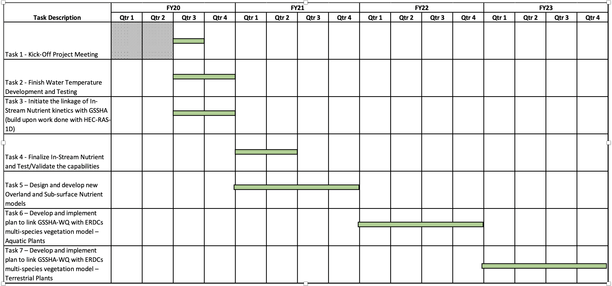

#### Last revision: June 14, 2020, based on May 6, 2020 Word document draft.

Each P2 Project shall have a Project management plan (PMP). The PMP is a living document that will be updated during the project to reflect actual practices. Length and amount of detail should be commensurate with scope and complexity of the project. Most of the required information (below) should already be included in the project proposal. Significant changes in scope, costs, and schedules will be documented through amendment of the PMP after coordination and concurrence of the PDT and PMP Approver.

# I. PMP Approvers
* Direct Allotted Projects:  The PMP approver is the responsible technical director
* Reimbursable Projects:  The PMP approvers include the responsible branch chief and division chief that supervises the PM of the project's parent work item.

# II. PMP Outline
1. Project Title: ENGINEERING WITH NATURE - ENGINEERING DESIGN TOOL
2. P2 Project #: XXXX
3. PMP Approver: Dr. Elizabeth Ferguson
4. Complete List of PDT Members: This list should include the customer/sponsor, project manager, responsible branch chief(s), and all appropriate team members.

| Organization | Role | Name | Phone | E-Mail |
|---|---|---|---|---|
| CEERD-EP-W | Project Manager/PI | Dr. Todd E. Steissberg | (530) 219-7990 | Todd.E.Steissberg@usace.army.mil |
| CEERD-EP-W | Branch Chief/PM Proxy | Mr. Mark R. Noel | (601) 634-3275 | Mark.R.Noel@usace.army.mil |
| Team Member(s) |
| CEERD-EP-W | WQ/Vegetation module development, integration, and testing | Dr. Billy E. Johnson | (601) 415-6299 | Billy.E.Johnson@usace.army.mil |
| CEERD-EP-W | Database development and WQ/Vegetation integration | Mr. Kervi Ramos | (530) 601-7335 | Kervi.Ramos@usace.army.mil | kervramos@me.com | New Hire - Expected start date May 2020 |
| CEERD-EP-W | WQ/Vegetation integration and testing | Dr. Charles W. Downer | (305) 458-8443 | Charles.W.Downer@usace.army.mil |
| CEERD-EP-W | WQ/Vegetation integration and testing | Dr. Nawa Pradhan | 601-634-3837 | Nawa.Pradhan@usace.army.mil |
| CEERD-EP-W | WQ/Vegetation integration and testing | Dr. Zhonglong Zhang | (601) 421-9661 | zz3@pdx.edu |
| CEERD-EP-W | Graphical User Interface (GUI) Development and Data Visualization | Ms. Lora Johnson | New Hire | New Hire - Expected start date May 2020 |
| CEERD-EE-W | PM Proxy | Todd Swannack | (601) 415-3509 | Todd.M.Swannack@usace.army.mil |
| CEERD-EE-W | PM Proxy | Christine Vanzomeren | (601) 634-3702 | Christine.M.Vanzomeren@usace.army.mil |
| CEERD-EM-J | PM Proxy | Jessica Coleman  | 601-634-3976 | Jessica.G.Coleman@us.army.mil |

## 5. References:  
* **Coastal and Hydraulics Laboratory:** Dr. Charles W. Downer and Dr. Nawa Pradhan
* **Environmental Laboratory:** Dr. Todd S. Bridges, Dr. Patrick N. Deliman, and Dr. Todd M. Swannack
* **San Antonio River Authority:** Mr. Steve Graham and Ms. Sheeba Thomas
* **University of Texas, San Antonio:** Dr. Hatim Sharif
* **Portland State University:** Dr. Zhonglong Zhang
* **RESPEC Inc.:** Dr. Russell Persyn and Mr. John Imhoff
* **LimnoTech Inc:** Dr. Tim Dekker

## 6. Background/Problem Description: 

Nutrient flow impacts how species utilize their resources across large scales. Invasive species can capitalize on changes in nutrient dynamics and can outcompete other species. Currently, nutrient flow is not simulated across watershed scales, which prevents accurate prediction of how species will spatially distribute themselves across a landscape. To address this challenge, we will incorporate nutrient flow into GSSHA and will then couple ERDC's multi-species vegetation model into the GSSHA framework. We will leverage existing ERDC relationships with the San Antonio River Authority to optimize proof-of-concept design.

## 7.  Technical Objective/Project Scope: 

GSSHA is a multidimensional modeling technology, developed by the U.S. Army Engineer Research and Development Center (ERDC), which uniformly couples overland, surface, and subsurface flow for accurate watershed simulation. It is a physics-based, distributed, hydrologic, sediment and constituent fate and transport model that features the following:

* Two-dimensional (2D) overland flow and groundwater and one-dimensional (1D) stream flow and soil moisture 
* Fully dynamic pipe networks for urban and agricultural drainage systems 
* Wetland peat layer hydrodynamics and several in-stream weir and culvert models 
* Lakes, detention basins, levees, rating and rule curve releases 
* Boundary conditions for hurricane storm surge or levee breach inundation modeling 
* Full coupling among groundwater, vadose zone, streams, and overland flow 
* Full-Gr-coupled groundwater to surface-water interaction to model Hortonian and non-Hortonian basins 

GSSHA can be used as an episodic or continuous model where soil surface moisture, groundwater levels, stream interactions, and constituent fate are continuously simulated. The fully coupled groundwater to surface-water interaction allows GSSHA to model basins in both arid and humid environments. The model simulates sediment and constituent fate and transport in shallow soils, overland flow planes, streams, and channels.

The Environmental Laboratory (EL) is developing a modeling framework that will be able to integrate hydrologic, hydrodynamic, water quality and vegetation modeling into a modeling system with visualization and analysis capabilities that will enable evaluating system vulnerabilities and identifying adaptation pathways to improve the resilience of coastal ecosystems to environmental stresses. These stresses include increasing frequency and intensity of coastal storm surges and extreme precipitation events, rising sea levels, decreasing freshwater flows, and increased salinity intrusion. The ClearWater modeling system models and framework simulate complex and dynamic interactions involving hydrology, hydrodynamics, salinity, sediment transport, soil chemistry and physics, vegetation, and water quality. 

In regard to water quality kinetics, ERDC-EL's ClearWater (Computational Library for Environmental and Analysis and Restoration of Watersheds) modules provide simulated temperature, nutrients, dissolved oxygen, salinity, and algae, as well as toxic organic contaminants.

The objective of this project is to develop techniques to take flow and sediment information from GSSHA to drive existing and new nutrient fate and transport capabilities that will be built within the ClearWater modeling system. In addition, this project will develop techniques to take flow, sediment, and nutrient information to drive the ERDC's multi-species community-based models for aquatic and terrestrial vegetation. In order to facilitate the efficient transfer of information, the setup of models, and the visualization of model results, this project will design and build databases to storage large datasets and provide ready access for multiple models, design and build graphical user interfaces to facilitate input of a variety of nutrient and vegetation input, and design and build advanced data visualization capabilities for these datasets.

Major Project Tasks:

* Kick-Off Project Meeting
* Finalize and Test Water Temperature capabilities within GSSHA
* Develop In-Stream WQ Model
* Design and Develop Overland and Sub-surface WQ Models
* Develop and implement plan to link GSSHA-WQ with ERDC's multi-species vegetation model - Aquatic Plants
* Develop and implement plan to link GSSHA-WQ with ERDC's multi-species vegetation model - Terrestrial Plants

## 8. Technical Approach/Study Plan: 

### <ins>FY20:</ins>

### Task 1 - Kick-Off Project Meeting

Design Meeting - Teleconference - This meeting will present the Project Management Plan to the project team and collaborators in order to solicit consensus and modifications to the goals of the project. As part of this meeting, we will discuss the approach we are taking in regards to developing flow and sediment solution files for driving the nutrient simulations within the ClearWater modeling system and then develop nutrient solution files, that in conjunction with GSSHA flow and sediment solution files, will be used to drive vegetation simulations within the ERDC Multi-species Vegetation Model for Aquatic and Terrestrial communities.

In addition to the technical discussions, this meeting will discuss leveraging opportunities between our collaborators with on-going reimbursable projects and work units, and identifying additional funding lines that can be used to expand our ability to model Nature Based Features for flow, sediment, nutrients, contaminants, and vegetation.

### Task 2 - Finish Water Temperature Development and Testing 

* **a. Finalize Overland Water Temperature integration with GSSHA.** In-stream water temperature has been implemented within GSSHA and Overland water temperature is being finalized and tested.
* **b. Use Goodwin Creek Watershed (Mississippi) to test and validate in-stream and overland water temperature routines.** Data has been gathered for the Goodwin Creek Watershed and will be used to test for any programming errors and to validate the water temperature process descriptions.

### Task 3 - Initiate the linkage of In-Stream Nutrient kinetics with GSSHA (build upon work done with HEC-RAS-1D) 

* **a. Modify existing in-stream nutrient model to run stand-alone.** The current in-stream nutrient model will be modified to interact with the other models in the ClearWater modeling system, linking the nutrient model with flow and sediment solutions files from GSSHA.
* **b. Determine flow and sediment data, and frequency, needed from GSSHA to drive the in-stream nutrient model.** An analysis will be done to identify the key information, and frequency of that information, that is needed to drive the in-stream nutrient model simulations. These data will be written into a database that will allow for large data storage and easy retrieval by the in-stream nutrient model.
* **c. Design a data storage system sufficient to store and retrieve the necessary data for GSSHA and the in-stream nutrient model.** In order to facilitate the transfer of large amounts of data between models, GUIs, and Data visualization tools, a data storage system will be designed and built. We will investigate current systems and methods to ensure that we are on the cutting edge of managing large datasets.
* **d. Initiate development of a GUI for setting up the in-stream nutrient model and visualizing in-stream nutrient model output.** A nutrient GUI will be developed that will allow users to easily setup the in-stream nutrient model, offer help and advice on estimating model parameters, and provide advanced data visualization for input data and model results.

### <ins>FY21:</ins>

### Task 4 - Finalize In-Stream Nutrient and Test/Validate the capabilities

* **a. Finalize in-stream nutrient model development**. Given the late FY20 start, the work initiated in FY20 will be completed in FY21.
* **b. Finalize and test data storage and retrieval between GSSHA and the in-stream nutrient model.** Given the late FY20 start, the work initiated in FY20 will be completed in FY21.
* **c. Finalize and test the in-stream nutrient model GUI and data visualization tools**. Given the late FY20 start, the work initiated in FY20 will be completed in FY21.
* **d. Validate the GSSHA and in-stream model using existing field data**. In conjunction with our project partners and collaborators, existing field data will be identified for model validation. It is anticipated that the San Antonio River Authority will be able to assist with this effort.

### Task 5 - Design and develop new Overland and Sub-surface Nutrient models

* **a. Design and develop a new Overland and Sub-surface nutrient model**. The models within the ClearWater modeling system currently do not account for nutrient processes in the overland and sub-surface regimes so new models will be built.
* **b. Finalize and test data storage and retrieval between GSSHA and the Overland and Sub-surface nutrient models**. The data storage system will be upgraded to storage information relevant to the overland and sub-surface models.
* **c. Finalize and test the Overland and Sub-surface nutrient models GUI and data visualization tools**. The GUI and Data Visualization tools will be upgraded to include the Overland and Sub-surface nutrient models.
* **d. Validate the GSSHA and Overland and Sub-surface models using existing field data**. In conjunction with our project partners and collaborators, existing field data will be identified for model validation. It is anticipated that the San Antonio River Authority will be able to assist with this effort.

### <ins>FY22:</ins>

### Task 6 - Develop and implement plan to link GSSHA-WQ with ERDC's multi-species vegetation model - Aquatic Plants

* **a. Determine proper flow, sediment, and water quality information that needs to be stored by GSSHA-Water Quality and develop and implement plan to link GSSHA-WQ with ERDC's multi-species vegetation model - Aquatic Plant model**. The project team will work with other EL team members to ensure that the needed GSSHA and ClearWater module solution files are provided to drive the aquatic plant dynamics.
* **b. Finalize and test data storage and retrieval between GSSHA and the Aquatic Plant model**. The data storage system will be upgraded to store information needed for the aquatic vegetation model.
* **c. Finalize and test the Aquatic Plant GUI and data visualization tools**. The GUI will be upgraded to include setup and data visualization for the aquatic plant model.
* **d. Validate the GSSHA-WQ and the Aquatic Plant model using existing field data**. The project team will work with other EL team members to test and validate the linkage between GSSHA-WQ for Aquatic Vegetation simulations.

### <ins>FY23:</ins>

### Task 7 - Develop and implement plan to link GSSHA-WQ with ERDC's multi-species vegetation model - Terrestrial Plants

* **a. Determine proper flow, sediment, and water quality information that needs to be stored by GSSHA-WQ and develop and implement plan to link GSSHA-WQ with ERDC's multi-species vegetation model - Terrestrial Plant model**. The project team will work with other EL team members to ensure that the needed GSSHA and ClearWater module solution files are provided to drive the terrestrial plant dynamics.
* **b. Finalize and test data storage and retrieval between GSSHA and the Terrestrial Plant model**. The data storage system will be upgraded to store information needed for the terrestrial vegetation model.
* **c. Finalize and test the Terrestrial Plant GUI and data visualization tools**. The GUI will be upgraded to include setup and data visualization for the terrestrial plant model.
* **d. Validate the GSSHA/Water Quality and the Terrestrial Plant model using existing field data**. The project team will work with other EL team members to test and validate the linkage between GSSHA-WQ for Terrestrial Vegetation simulations.

## 9. Scheduling and Milestones: 

#### Detailed Milestone Schedule/Products
<table> 
<header>
<tr style=vertical-align:top> 
<th> Task Description </th><th> Products </th><th> Estimated Completion Date </th><th> Actual Completion Date </th>
</tr>
</header>
<body>
<tr style=vertical-align:top> 
  <td> Task 1. Kick-Off Project Meeting </td><td> ~ <b>Meeting notes</b> that document broad design plan for the overall project </td><td> 5/1/2020 </td> <td> </td>
</tr>
<tr style=vertical-align:top> 
<td> Task 2. Finish Water Temperature Development and Testing: a. Finalize Overland Water Temperature integration with GSSHA. </td><td> *~ Software*: Updated GSSHA model with water temperature capabilities. </td><td> 7/3/2020 </td><td> </td>
</tr>
<tr style=vertical-align:top> 
<td> Task 2. Finish Water Temperature Development and Testing: b. Use Goodwin Creek Watershed (Mississippi) to test and validate in-stream and overland water temperature routines. </td><td> *~ TN*: documentation of GSSHA water temperature testing and validation. </td><td> 9/30/2020 </td><td> </td>
</tr>
<tr style=vertical-align:top> 
<td> Task 3. Initiate the linkage of In-Stream Nutrient kinetics with GSSHA (build upon work done with HEC-RAS-1D): a. Modify existing in-stream nutrient model to run stand-alone. </td><td> *~ Progress report*: document current status of in-stream nutrient model and work that needs to be done to finalize it.   *~ Software*: in-stream nutrient model</td><td>9/30/2020</td><td> </td>
</tr>
<tr style=vertical-align:top> 
<td> Task 3. Initiate the linkage of In-Stream Nutrient kinetics with GSSHA (build upon work done with HEC-RAS-1D): b. Determine flow and sediment data, and frequency, needed from GSSHA to drive the in-stream nutrient model. </td><td> *~ TN*: documentation of flow and sediment data needed to drive the in-stream nutrient model. </td><td> 7/3/2020 </td><td> </td>
</tr>
<tr style=vertical-align:top> 
<td> Task 3. Initiate the linkage of In-Stream Nutrient kinetics with GSSHA (build upon work done with HEC-RAS-1D): c. Design a data storage system sufficient to store and retrieve the necessary data for GSSHA and the in-stream nutrient model. </td><td> *~ TN*: design plan for the data storage system   *~ Software*: database </td><td> 8/28/2020 </td><td> </td>
</tr>
<tr style=vertical-align:top> 
<td> Task 3. Initiate the linkage of In-Stream Nutrient kinetics with GSSHA (build upon work done with HEC-RAS-1D): d. Initiate development of a GUI for setting up the in-stream nutrient model and visualizing in-stream nutrient model output. </td><td> *~ TN*: describes the GUI and data visualization capabilities for the in-stream nutrient model.   *~ Software*: Graphical User Interface (GUI) </td><td> 9/30/2020 </td><td> </td>
</tr>
<tr style=vertical-align:top> 
<td> Task 4. Finalize In-Stream Nutrient and Test/Validate the capabilities: a. Finalize in-stream nutrient model development. </td><td> *~ TN*: document current in-stream nutrient model capabilities.   *~ Software*: in-stream nutrient model </td><td> 12/31/2020 </td><td> </td>
</tr>
<tr style=vertical-align:top> 
<td> Task 4. Finalize In-Stream Nutrient and Test/Validate the capabilities: b. Finalize and test data storage and retrieval between GSSHA and the in-stream nutrient model. </td><td> *~ Software*: GSSHA with updated output options to write needed flow and sediment information to drive the in-stream nutrient model </td><td> 12/31/2020 </td><td> </td>
</tr>
<tr style=vertical-align:top> 
<td> Task 4. Finalize In-Stream Nutrient and Test/Validate the capabilities: c. Finalize and test the in-stream nutrient model GUI and data visualization tools. </td><td> *~ Software*: In-stream nutrient model GUI and data visualization tools </td><td> 3/31/2021 </td><td> </td>
</tr>
<tr style=vertical-align:top> 
<td> Task 4. Finalize In-Stream Nutrient and Test/Validate the capabilities: d. Validate the GSSHA and in-stream model using existing field data. </td><td> *~ TN*: documentation of GSSHA and in-stream nutrient model testing and validation </td><td> 6/30/2021 </td><td> </td>
</tr>
<tr style=vertical-align:top> 
<td> Task 5. Design and develop new Overland and Sub-surface Nutrient models: a. Design and develop a new Overland and Sub-surface nutrient model. </td><td> *~ TN*: documentation of Overland and Sub-surface Nutrient model design plan   *~ Software*: Overland and Sub-surface Nutrient models </td><td> 7/31/2021 </td><td> </td>
</tr>
<tr style=vertical-align:top> 
<td> Task 5. Design and develop new Overland and Sub-surface Nutrient models: b. Finalize and test data storage and retrieval between GSSHA and the Overland and Sub-surface nutrient models. </td><td> *~ Software*: GSSHA with updated output options to write needed flow and sediment information to drive the Overland and Sub-surface Nutrient models </td><td> 7/31/2021 </td><td> </td>
</tr>
<tr style=vertical-align:top> 
<td> Task 5. Design and develop new Overland and Sub-surface Nutrient models: c. Finalize and test the Overland and Sub-surface nutrient models GUI and data visualization tools. </td><td> *~ Software*: Overland and Sub-surface nutrient GUI and data visualization tools </td><td> 9/30/2021 </td><td> </td>
</tr>
<tr style=vertical-align:top> 
<td> Task 5. Design and develop new Overland and Sub-surface Nutrient models: d. Validate the GSSHA and Overland and Sub-surface models using existing field data. </td><td> *~ TN*: documentation of GSSHA and Overland and Sub-surface nutrient model testing and validation </td><td> 9/30/2021 </td><td> </td>
</tr>
<tr style=vertical-align:top> 
<td> Task 6. Develop and implement plan to link GSSHA-WQ with ERDC's multi-species vegetation model - Aquatic Plants: a. Determine proper flow, sediment, and water quality information that needs to be stored by GSSHA-Water Quality and develop and implement plan to link GSSHA-WQ with ERDC's multi-species vegetation model - Aquatic Plant model. </td><td> *~ TN*: design plan for linking GSSHA-WQ with ERDC Multi-Species Vegetation Model - Aquatic Vegetation   *~ Software*: Updated GSSHA and Nutrient Models able to provide the needed information to drive the ERDC Multi-Species Vegetation Model: Aquatic Vegetation </td><td> 3/31/2022 </td><td> </td>
</tr>
<tr style=vertical-align:top> 
<td> Task 6. Develop and implement plan to link GSSHA-WQ with ERDC's multi-species vegetation model - Aquatic Plants: b. Finalize and test data storage and retrieval between GSSHA and the Aquatic Plant model. </td><td> *~ TN*: Database design plan for storing the necessary aquatic vegetation data   *~ Software*: Updated database for Aquatic Vegetation </td><td> 6/30/2022 </td><td> </td>
</tr>
<tr style=vertical-align:top> 
<td> Task 6. Develop and implement plan to link GSSHA-WQ with ERDC's multi-species vegetation model - Aquatic Plants: c. Finalize and test the Aquatic Plant GUI and data visualization tools. </td><td> *~ TN*: documentation of the Aquatic Vegetation GUI and data visualization tools   *~ Software*: Graphical User Interface (GUI) </td><td> 9/30/2022 </td><td> </td>
</tr>
<tr style=vertical-align:top> 
<td> Task 6. Develop and implement plan to link GSSHA-WQ with ERDC's multi-species vegetation model - Aquatic Plants: d. Validate the GSSHA-Water Quality and the Aquatic Plant model using existing field data. </td><td> *~ TN*: documentation of GSSHA-WQ and Aquatic Vegetation model testing and validation </td><td> 9/30/2022 </td><td> </td>
</tr>
<tr style=vertical-align:top> 
<td> Task 7. Develop and implement plan to link GSSHA-WQ with ERDC's multi-species vegetation model - Terrestrial Plants: a. Determine proper flow, sediment, and water quality information that needs to be stored by GSSHA-Water Quality and develop and implement plan to link GSSHA-WQ with ERDC's multi-species vegetation model - Terrestrial Plant model </td><td> *~ TN*: design plan for linking GSSHA-WQ with ERDC Multi-Species Vegetation Model - Terrestrial Vegetation   *~ Software*: Updated GSSHA and Nutrient Models able to provide the needed information to drive the ERDC Multi-Species Vegetation Model - Terrestrial Vegetation </td><td> 3/31/2023 </td><td> </td>
</tr>
<tr style=vertical-align:top> 
<td> Task 7. Develop and implement plan to link GSSHA-WQ with ERDC's multi-species vegetation model - Terrestrial Plants: b. Finalize and test data storage and retrieval between GSSHA and the Terrestrial Plant model. </td><td> *~ TN*: Database design plan for storing the necessary terrestrial vegetation data   *~ Software*: Updated database for Terrestrial Vegetation </td><td> 6/30/2023 </td><td> </td>
</tr>
<tr style=vertical-align:top> 
<td> Task 7. Develop and implement plan to link GSSHA-WQ with ERDC's multi-species vegetation model - Terrestrial Plants: c. Finalize and test the Terrestrial Plant GUI and data visualization tools. </td><td> *~ TN*: documentation of the Terrestrial Vegetation GUI and data visualization tools   *~ Software*: Graphical User Interface (GUI) </td><td> 9/30/2023 </td><td> </td>
</tr>
<tr style=vertical-align:top> 
<td> Task 7. Develop and implement plan to link GSSHA-WQ with ERDC's multi-species vegetation model - Terrestrial Plants: d. Validate the GSSHA-Water Quality and the Terrestrial Plant model using existing field data. </td><td> *~ TN*: documentation of GSSHA-WQ and Terrestrial Vegetation model testing and validation </td><td> 9/30/2023 </td><td> </td>
</tr>
</body>
</table>

## 10. Technology Transfer:  

Products will be disseminated through standard ERDC reporting systems (ERDC Library and Web sites) and software servers.

## 11. Sponsor's Role:  

In order to keep this project on track, the project team will coordinate with the Program Managers to ensure that any critical milestones associated with other projects (e.g. ERDC Multi-species Vegetation Model) within this program are identified and managed so as not to adversely affect the delivery of products listed in this PMP.

## 12. Resource Plan:  

#### FY20
| Resource Item | Amount   ($K) |
| :-- | --: |
| **OTHFACSVC**   Burdens   Contracts - Dr. Zhonglong Zhang (PSU) | 16.4   40.0 |
| **LABOR**   Dr. Todd Steissberg/Dr. Billy Johnson - EL   Mr. Kervi Ramos - EL   GUI/Data Visualization - Ms. Lora Johnson - EL   Dr. Charles Downer - CHL   Dr. Nawa Pradhan - CHL | 35.0   50.0   50.0   35.0   49.0 |
| **BURDENS** | 7.2 |
| **TRAVEL** | 17.4 |
| **SUPMATRLS** | 0.0 |
| **TOTAL** | 300.0 |

It is anticipated that this project will cover FY20 to FY23: FY21 - \$300K, FY22 - \$300K, and FY23 - \$300K.  Task 1 will better refine the technical tasks within this project, identify existing data to be used for model validation and explore additional funding lines to support broader model development for Nature Based Features. Once we have had those discussions then we will be in a better position to develop funding allocations for FY21 to FY23. The PMP will be updated once we have those funding allocations.

## 13. Funding Information:  Indicate funding received.  Type indicates Project Order (PO), Direct Fund Cite (DFC), etc.

| Order Number | Type | Received | Expiration | Amount |
|---|---|---|---|---|
||||||

## 14. Communication Strategy:  

The project team provide progress reports at the frequency set by the Program Manager-s Office. Internally, the project team, and collaborators, will communicate via e-mail, WebEx, and in-person meetings as needed to ensure the milestones are being successfully completed on time. If any issues develop that may impact the milestones, then the project lead will immediately information the program managers and a discussion of how to overcome the issues will be done.

## 15. Quality Management Plan:  

Standard software development processes will be followed in creating the models, GUIs, Databases, and Data Visualization tools. Standard statistical analyses will be done when evaluating whether the models are successfully simulating nutrient and vegetation processes.

## 16. Safety and Occupational Health Plan (SOHP):    

All the work will be done in an office setting so no SOHP is necessary.

| __________________________________ | _____________________ |
| :-- | :-- |
| Project Manager |Date |

# III.  Thresholds for Changes in the PMP

There are three thresholds based on scope, cost, and time. These include:
* Scope: A sponsor, product, or other major milestone is dropped or added (e.g., report, field test, model).
* Cost: At any point, the total cost changes by +/- 25% from the current plan.
* Time: The PMP Approver will immediately contact Sponsors when the PM submits a PMP approval request showing any initial milestone dates being delayed. Based on discussions with the sponsor, revised milestone date(s) will then be coordinated with the PDT.
* Statusing: The PM is responsible for "statusing" activities in P2. As the project dictates, activity work plans will be submitted to the PM for approval prior to the start of an activity. Activity works plans will include planned technical objectives and study and research methodologies and attached to the activity as noted in item 9 above.

# IV. Project Files

A file should be maintained on each project executed within the lab and retained for six years in accordance with Army Records Information Management System (ARIMS) requirements. Each project file shall include:
* Proposal or Scope of Work with a copy of the signed transmittal letter
* Approved PMP (all versions) and related documents (study plans, etc.)
* Funding documents 
* Authorizations
* Status and draft reports with transmittal letters
* Technical drawings
* Photographs
* Meeting Notes
* Briefings
* Correspondence

After six years, the project files are to be reviewed by the records office for final deposition. Lab notebooks, raw data and metadata are to be retained for 30 years.

Note: P2 also allows for an effective and endless repository of electronic information. We suggest using the P2 Project WP/Doc area as a place to keep electronic copies of the above-mentioned files and appropriate backups. It is a wise idea to maintain hardcopies as well.
